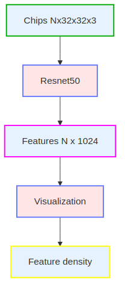
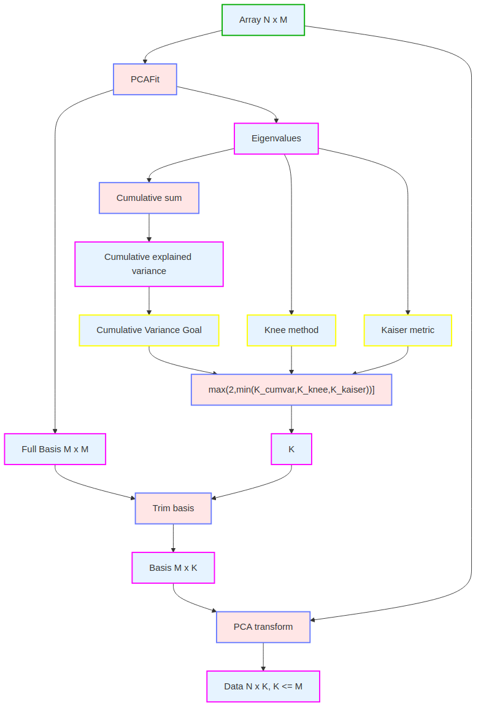
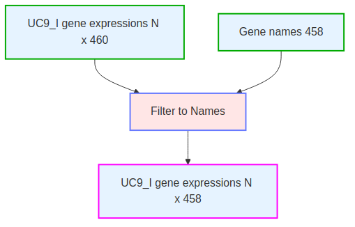
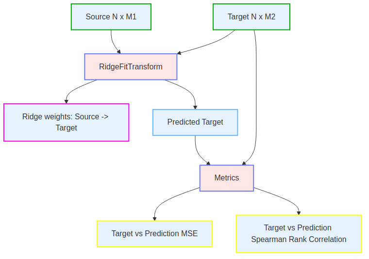
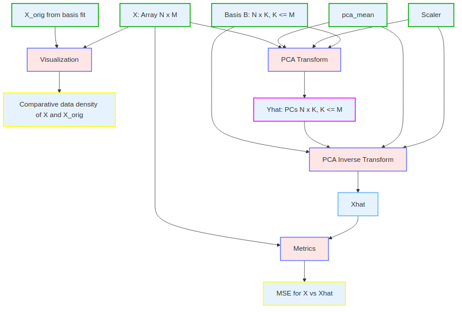
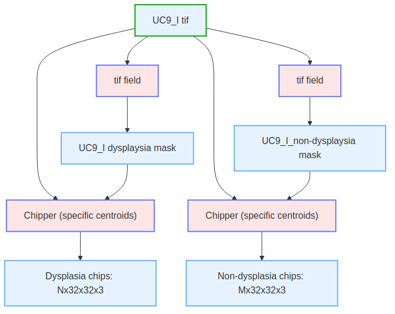
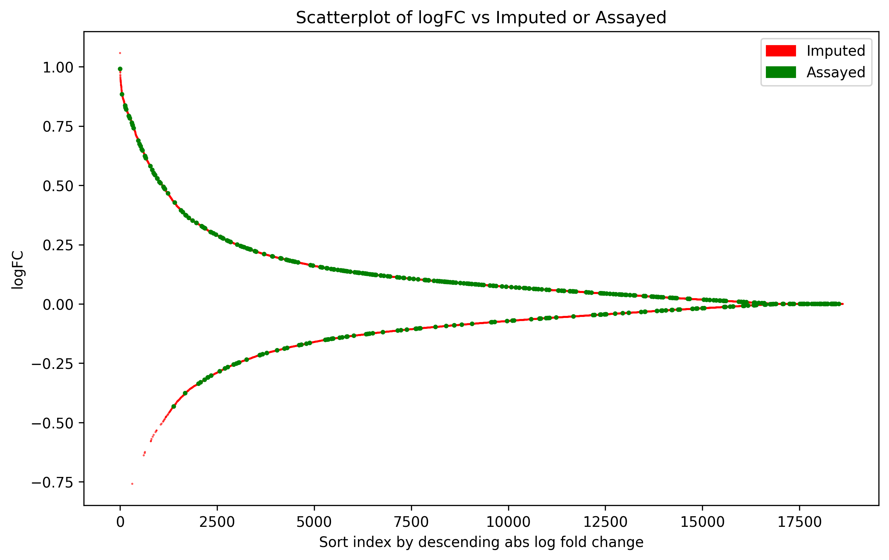

# Method Description

The method is as follows:

## Unpack scRNA data
 

## Unpack UC9_I patches and genes
  

## Template patches to features
  

## UC9_I patches to features 
Apply patches to features pipeline to UC9_I patches.

## Template principal component dimension reduction fit and transform pipeline
  

## UC9_I features to PCs
Apply principal component dimension reduction pipline to features for MSE <= 0.16.

## UC9_I Genes 460 to Genes 458

## UC9_I Genes 458 to PCs
Apply PCA transform pipeline to UCI_9 458 gene expressions for MSE <= 0.064.

## Template Ridge regression fit pipeline

## UC9_I Regress Feature PCs to Gene PCs
Apply Ridge regression fit pipeline to create a linear map from Feature PCs to Gene PCS.

## Template PCA transform pipeline

## scRNA Genes 458 to UC9_I Genes 458 basis PCs
Apply PCA transform pipeline with UC9_I Genes 458 PCA basis to map scRNA Genes 458 to PCs.

## scRNA Genes 18157 to PCs
Apply PCA fit transform pipeline to scRNA 18157 gene expressions for MSE <= 0.064.

## scRNA Regress Gene 458 PCs to Gene 18157 PCs
Apply Ridge regression pipeline to create a linear map from Gene 458 PCs to Gene 18157 PCS.

## UC9_I TIF Unpack

## Dysplasia/Non-dysplasia chips to 1024 features
Apply patches to features pipeline to dysplasia/non-dysplasia patches.

## Dysplasia/Non-dysplasia 1024 features to Feature PCs
Apply PCA transform pipeline to features using UC9_I Feature PCs basis.

## Template Ridge transform pipeline

## Dysplasia/Non-dysplasia Feature PCs to 458 Gene PCs
Apply Ridge transform pipeline to feature PCs using UC9_I feature PCs to Gene PCs weights.

## Dysplasia/Non-dysplasia 458 Gene PCs to 18157 Gene PCs
Apply Ridge transform pipeline to 458 Gene PCs using scRNA 458 PCs to 18157 PCs weights.

## Dysplasia/Non-dysplasia 18157 Gene PCs to 18157 Genes
Apply inverse PCA transform pipeline to gene PCs using scRNA 18157 gene basis.

## Dysplasia/Non-dysplasia 458 Gene PCs to 458 Genes
Apply inverse PCA transform pipeline to gene PCs using scRNA 18157 gene basis.

## Dysplasia/Non-dysplasia 458 Genes and 18157 Genes to 18615 Gene Expression
Concatenate.

## Genes ranked by highest absolute differential expression
  

Scatterplot of logFC vs Imputed or Assayed, X-axis is sort index by descending abs log fold change:

  

# Rationale

For the gene panel we suggest to take the top 500 genes in our sorted list which is ranked by absolute value of log fold change between dysplasia and non-dysplasia chips.

# Data and Resources Used

We use only the data provided by Broad Institute.  We do not use external data.  We use the registered images.  We don't do anything with the unregistered images.  We use the provided Crunch 3 dataset to select dysplasia and non-dysplasia cells for analysis.

We use the large dataset for UC9_I, the UC9_I tif files and the scRNA data.

We train on an Ubuntu PC with 1TB of SSD, an Intel Core i9 processor, 64GB of RAM, and an NVidia GTX 3060 with 12GB of VRAM.
