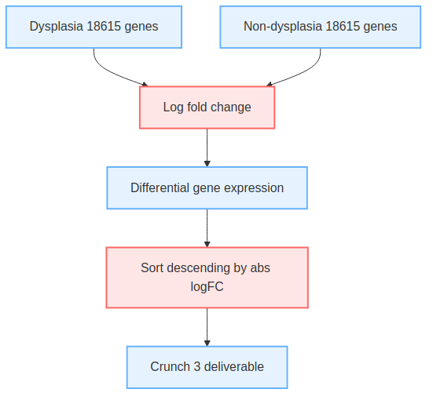
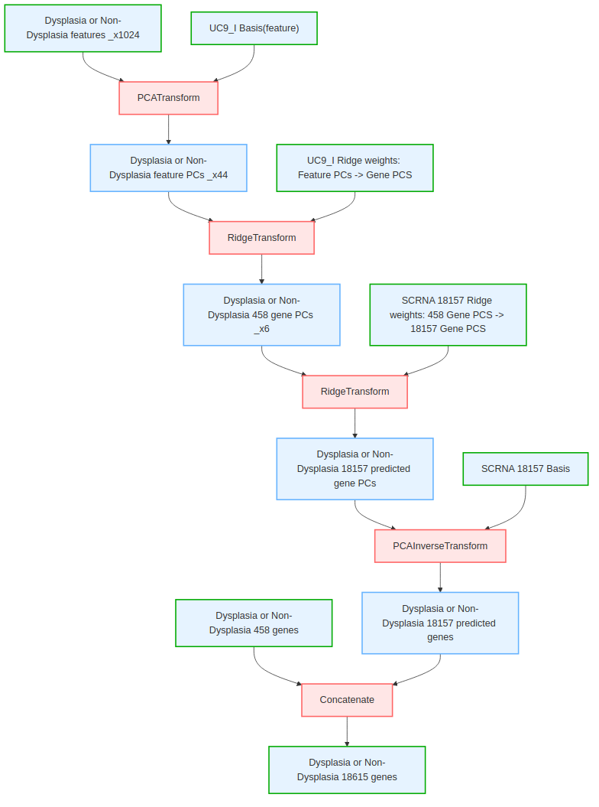
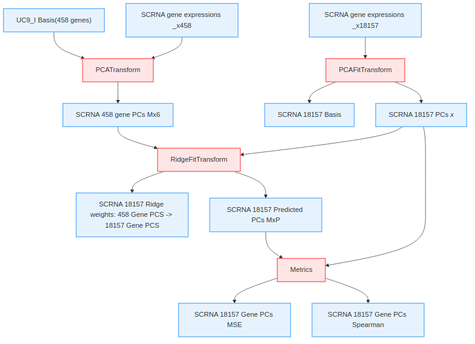
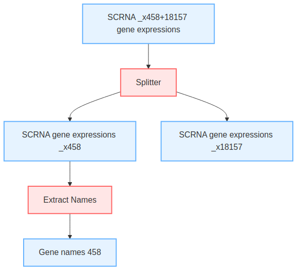
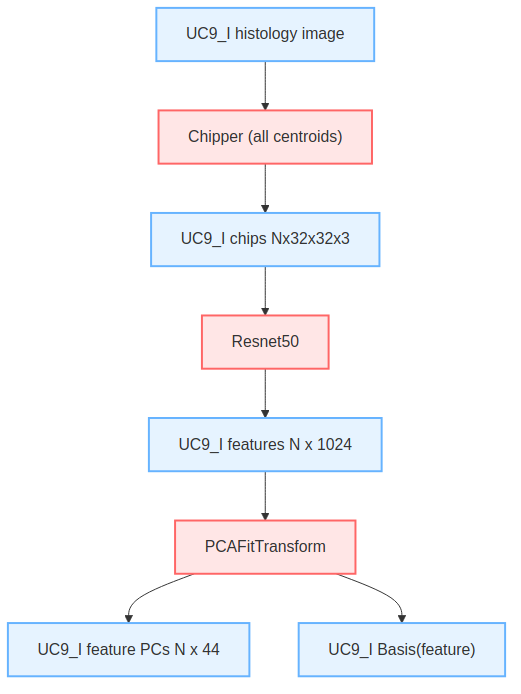
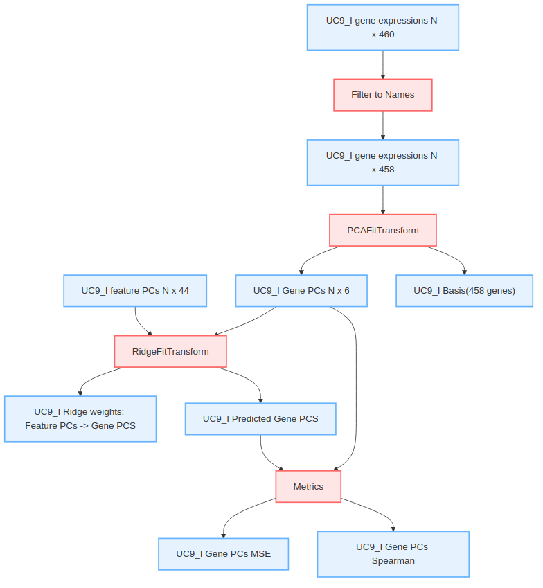
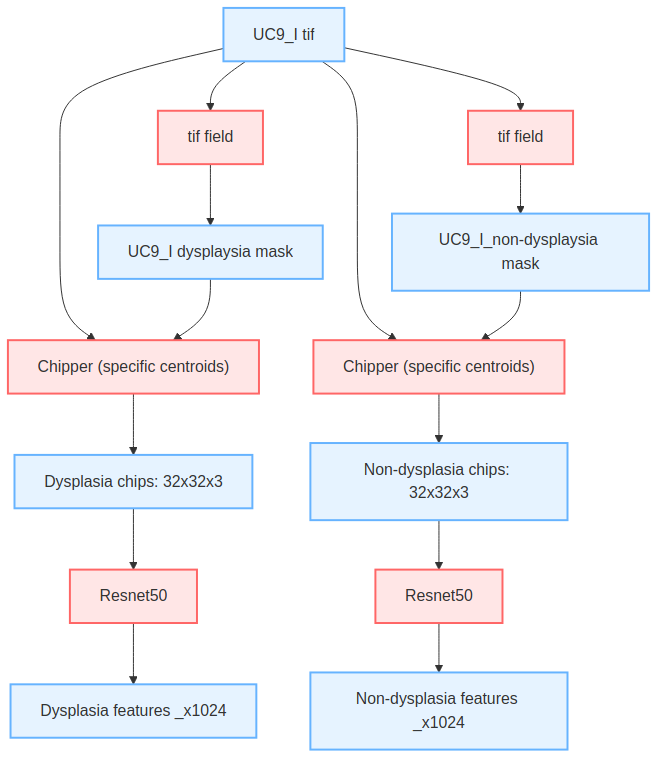

# Method Description

This method uses the baseline quickstart code as follows:

* Predict the Expression of 460 Measured Genes: This step uses a ResNet50 embedding model and regression models, trained on H&E pathology images, to predict the expression of 460 genes for each cell in the dataset.  Call these the *assayed* genes.

* Predict the Expression of 18157 Unmeasured Genes: Leveraging the gene expressions for the assayed genes and a single-cell RNA sequencing (scRNA-Seq) reference dataset, a similarity-based method is applied to infer the expression of 18157 unmeasured genes for each cell in the dataset.  Call this the *imputed* set.

* Gene Ranking Using logFC Method: Apply the log fold change (logFC) method to rank genes based on their ability to differentiate between dysplastic and non-dysplastic tissue regions. 

# Diagram Documentation

## Core Workflow
  
*Description of crunch3 diagram*

  
*Description of plasia_gene_inference diagram*

## SCRNA Pipeline
  
*Description of calibration process*

  
*Data preparation steps*

## Feature Analysis
  
*Principal component visualization*

  
*Gene-level component analysis*

## Data Processing
  
*Image splitting methodology*

# Rationale

Our suggested gene panel is to take the top 500 genes in our list which is ranked by absolute value of log fold change. The logFC method computes the logarithmic fold change between the predicted expression values for the two regions (dysplastic and non-dysplastic). Genes are ranked based on the magnitude of their logFC values, with higher values indicating greater differentiation potential between the regions.

# Data and Resources Used

We use only the data provided by Broad Institute.  We do not use external data.  We use the registered images.  We don't do anything with the unregistered images.  We use the provided Crunch 3 dataset to select dysplasia and non-dysplasia cells for analysis.

We use the large dataset for UC9_I and we use as many samples from UC9_I for training as will fit in memory for our system.  

We train our regression model to predict 460 genes from cells in UC1_I and UC9_I large datasets.

From the UC9_I dataset we use the model to infer 460 gene expressions for 45712 cells for the dysplasia subset and
90491 from the non-dysplasia subset

Due to memory limitations we then randomly select 5000 cells from each of the dysplasia and non-dysplasia gene expression sets.

For these 5000 we then impute the 18157 unmeasured genes using the cosine similarity method.

We calculate mean, variance and absolute log fold change (logFC) for all 18615 protein-coding genes for each of the cancerous and non-cancerous samples.
