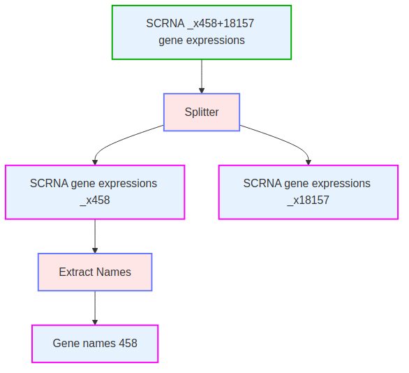
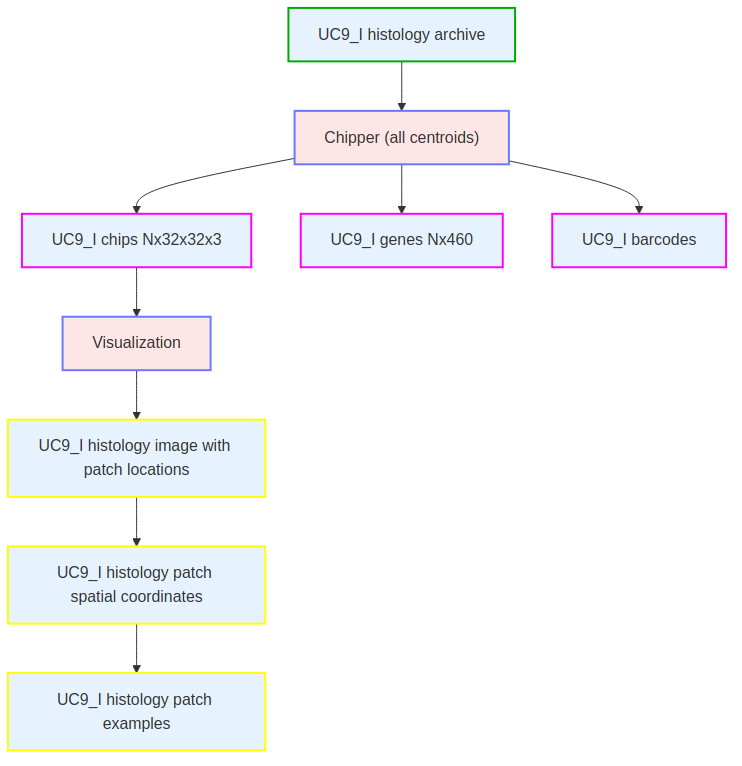
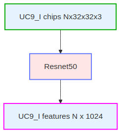
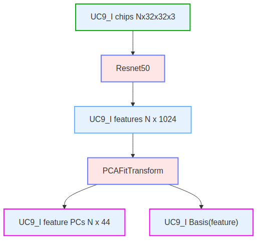
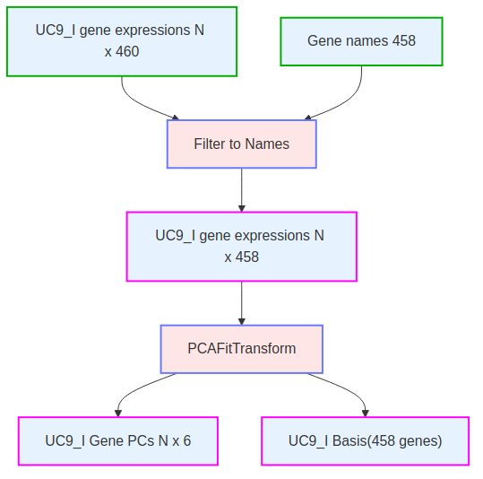
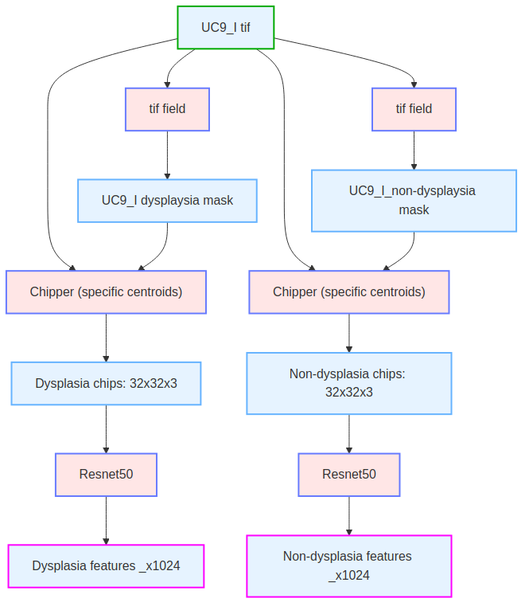
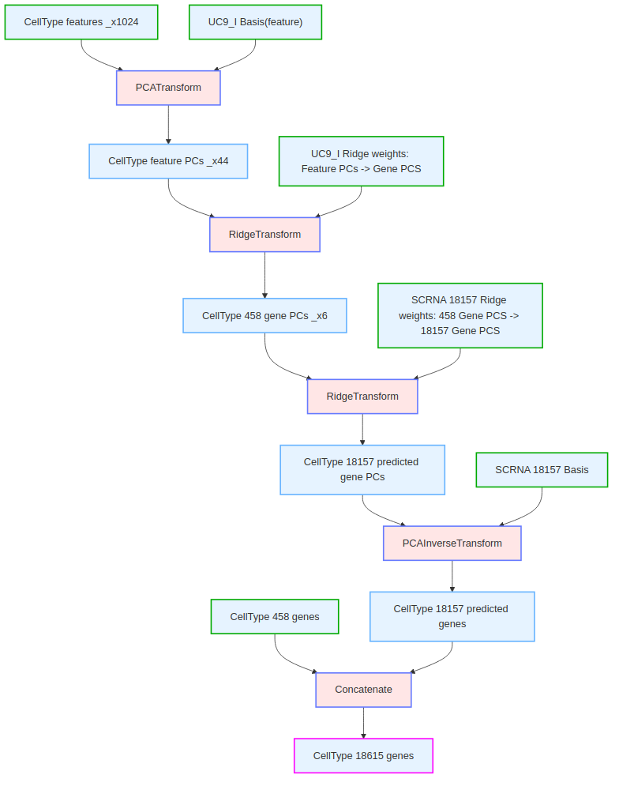
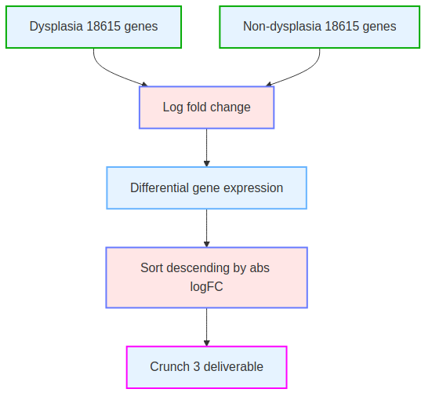

# Method Description

The method is as follows:

## Unpack scRNA data
 

## Unpack UC9_I patches and genes
  

## UC9_I patches to features 
  

## UC9_I features to PCs
  

## UC9_I Gene Predictor Fit

## scRNA Gene Predictor Fit

## UC9_I TIF splitter
  

## scRNA Gene Predictor Transform (apply to plasia and non-dysplasia gene sets)

## Genes ranked by highest absolute differential expression
  

# Rationale

For the gene panel we suggest to take the top 500 genes in our sorted list which is ranked by absolute value of log fold change between dysplasia and non-dysplasia chips.

# Data and Resources Used

We use only the data provided by Broad Institute.  We do not use external data.  We use the registered images.  We don't do anything with the unregistered images.  We use the provided Crunch 3 dataset to select dysplasia and non-dysplasia cells for analysis.

We use the large dataset for UC9_I, the UC9_I tif files and the scRNA data.

We train on an Ubuntu PC with 1TB of SSD, an Intel Core i9 processor, 64GB of RAM, and an NVidia GTX 3060 with 12GB of VRAM.
