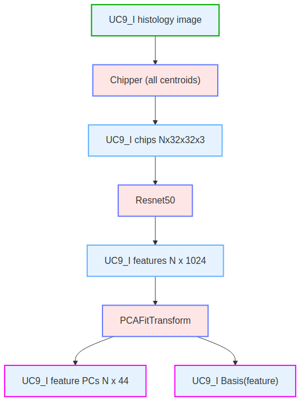

# Method Description

The method is as follows:

## Unpack scRNA data
  

## UC9_I features
  

## UC9_I Gene Predictor Fit

## scRNA Gene Predictor Fit

## UC9_I TIF splitter
  

## scRNA Gene Predictor Transform (apply to plasia and non-dysplasia gene sets)

## Genes ranked by highest absolute differential expression
  

# Rationale

Our suggested gene panel is to take the top 500 genes in our list which is ranked by absolute value of log fold change. The logFC method computes the logarithmic fold change between the predicted expression values for the two regions (dysplastic and non-dysplastic). Genes are ranked based on the magnitude of their logFC values, with higher values indicating greater differentiation potential between the regions.

# Data and Resources Used

We use only the data provided by Broad Institute.  We do not use external data.  We use the registered images.  We don't do anything with the unregistered images.  We use the provided Crunch 3 dataset to select dysplasia and non-dysplasia cells for analysis.

We use the large dataset for UC9_I and we use as many samples from UC9_I for training as will fit in memory for our system.  

We train our regression model to predict 460 genes from cells in UC1_I and UC9_I large datasets.

From the UC9_I dataset we use the model to infer 460 gene expressions for 45712 cells for the dysplasia subset and
90491 from the non-dysplasia subset

Due to memory limitations we then randomly select 5000 cells from each of the dysplasia and non-dysplasia gene expression sets.

For these 5000 we then impute the 18157 unmeasured genes using the cosine similarity method.

We calculate mean, variance and absolute log fold change (logFC) for all 18615 protein-coding genes for each of the cancerous and non-cancerous samples.
