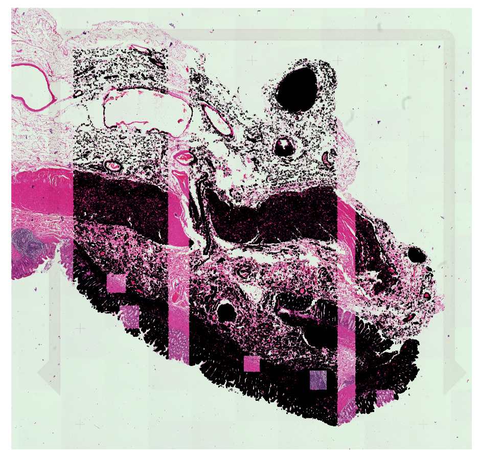
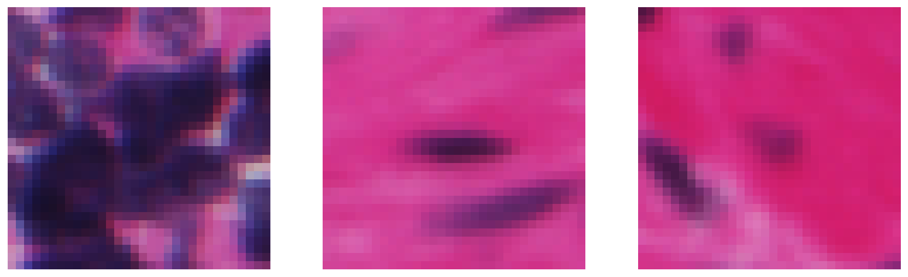
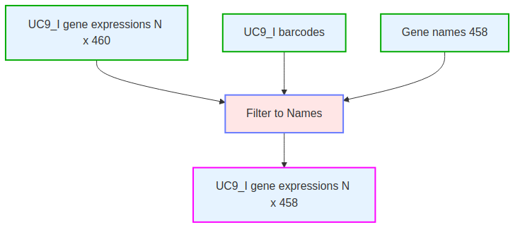
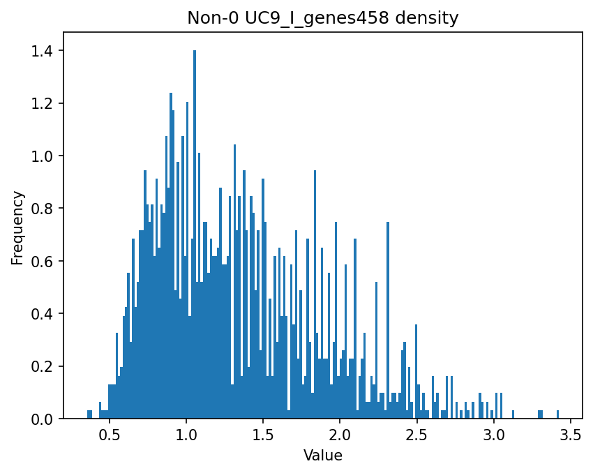
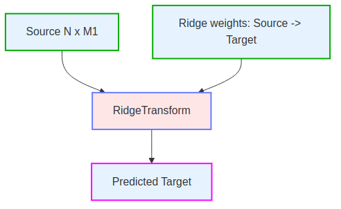
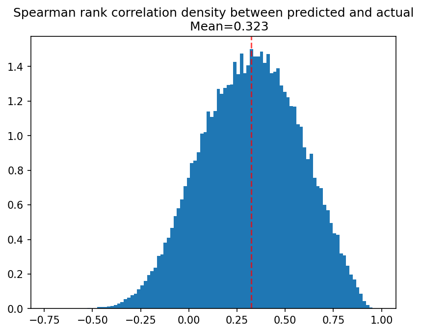
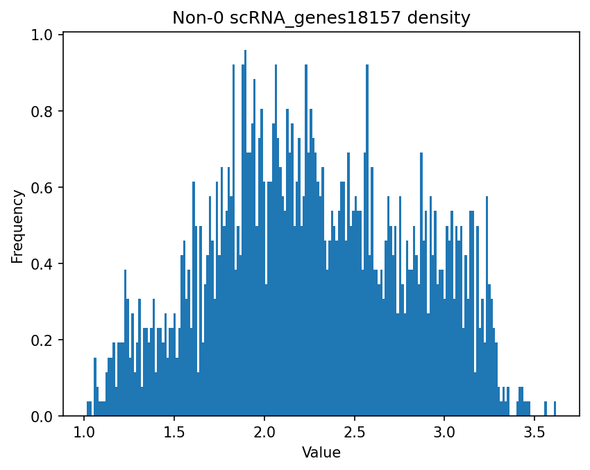
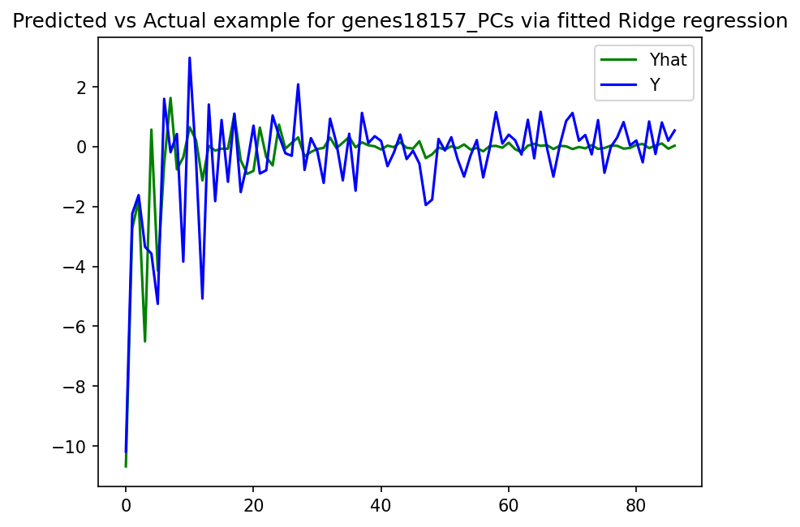
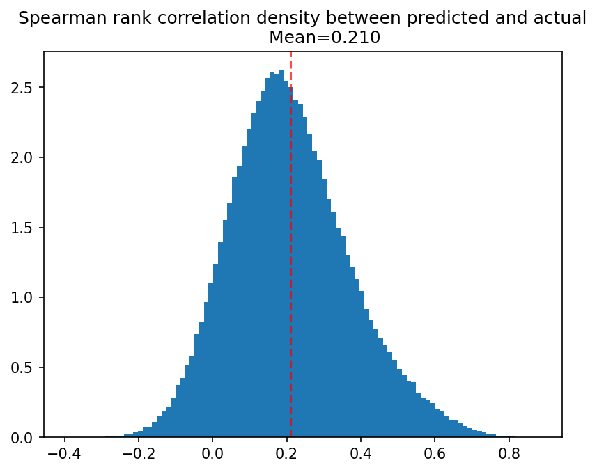
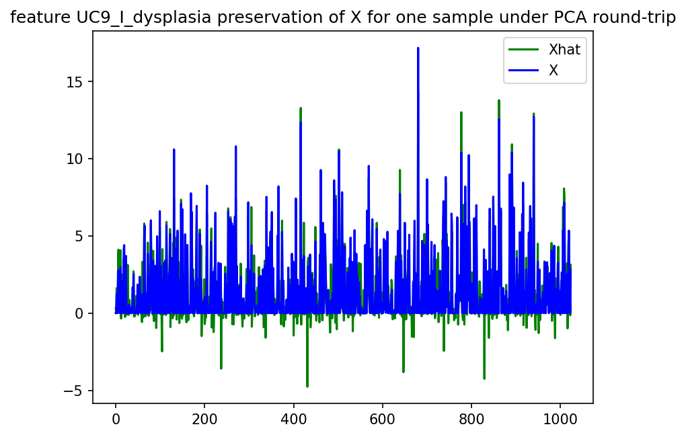

# Method Description

The method is as follows:

## Unpack scRNA data
 

## Unpack UC9_I patches and genes

Patches are 32x32x3 portions of the histology image.

Patch locations are shown as black dots on the UC9_I image:

The centroids are translated into spatial coordinates:

Here are examples of some patches:

Patches and genes are unpacked from the dataset with this process:

## Template patches to features

This uses Resnet50 with 32x32x3 images upsized to 224x224 to extract image features.  This is used as a dimension reduction.

  

This is the range of values produced by Resnet50 for features:

## UC9_I patches to features 

Apply patches to features pipeline to UC9_I patches.  

## Template principal component dimension reduction fit and transform pipeline

We will use PCA as a further dimension reduction on both patch features and gene expressions.  This is a template for the PCA dimension reduction process:

  

This process visualizes MSE for the feature reduction and the density of feature values.

## UC9_I features to PCs

Apply principal component dimension reduction pipline to features for MSE <= 0.16.

Here is MSE of feature reduction

Here is density of gene expression values:

## UC9_I Genes 460 to Genes 458

Our scRNA data only includes 458 of the 460 genes in the histology data, so we throw out 2 genes:

Here is the density of values in the 458 gene expressions:

## UC9_I Genes 458 to PCs
Apply PCA transform pipeline to UCI_9 458 gene expressions for MSE <= 0.064.

## Template Ridge regression fit pipeline

## UC9_I Regress Feature PCs to Gene PCs
Apply Ridge regression fit pipeline to create a linear map from Feature PCs to Gene PCS.

## Template PCA transform pipeline

## scRNA Genes 458 to UC9_I Genes 458 basis PCs
Apply PCA transform pipeline with UC9_I Genes 458 PCA basis to map scRNA Genes 458 to PCs.

## scRNA Genes 18157 to PCs
Apply PCA fit transform pipeline to scRNA 18157 gene expressions for MSE <= 0.064.

## scRNA Regress Gene 458 PCs to Gene 18157 PCs
Apply Ridge regression pipeline to create a linear map from Gene 458 PCs to Gene 18157 PCS.

## UC9_I TIF Unpack

## Dysplasia/Non-dysplasia patches to 1024 features
Apply patches to features pipeline to dysplasia/non-dysplasia patches.

## Dysplasia/Non-dysplasia 1024 features to Feature PCs
Apply PCA transform pipeline to features using UC9_I Feature PCs basis.

## Template Ridge transform pipeline

## Dysplasia/Non-dysplasia Feature PCs to 458 Gene PCs
Apply Ridge transform pipeline to feature PCs using UC9_I feature PCs to Gene PCs weights.

## Dysplasia/Non-dysplasia 458 Gene PCs to 18157 Gene PCs
Apply Ridge transform pipeline to 458 Gene PCs using scRNA 458 PCs to 18157 PCs weights.

## Dysplasia/Non-dysplasia 18157 Gene PCs to 18157 Genes
Apply inverse PCA transform pipeline to gene PCs using scRNA 18157 gene basis.

## Dysplasia/Non-dysplasia 458 Gene PCs to 458 Genes
Apply inverse PCA transform pipeline to gene PCs using scRNA 18157 gene basis.

## Dysplasia/Non-dysplasia 458 Genes and 18157 Genes to 18615 Gene Expression
Concatenate.

## Genes ranked by highest absolute differential expression
  

The following plot shows which impactful genes came from the original set of 460 and which came from imputation by Ridge regression:

  

## More pictures

# Rationale

For the gene panel we suggest to take the top 500 genes in our sorted list which is ranked by absolute value of log fold change between dysplasia and non-dysplasia patches.

# Data and Resources Used

We use only the data provided by Broad Institute.  We do not use external data.  We use the registered images.  We don't do anything with the unregistered images.  We use the provided Crunch 3 dataset to select dysplasia and non-dysplasia cells for analysis.

We use the large dataset for UC9_I, the UC9_I tif files and the scRNA data.

We train on an Ubuntu PC with 1TB of SSD, an Intel Core i9 processor, 64GB of RAM, and an NVidia GTX 3060 with 12GB of VRAM.
